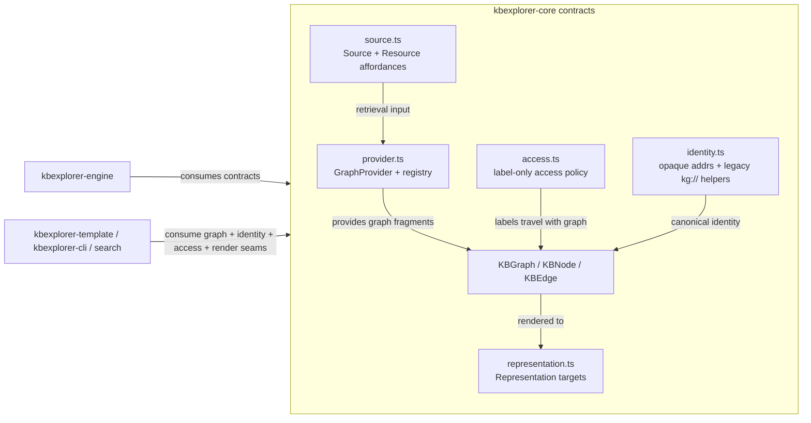
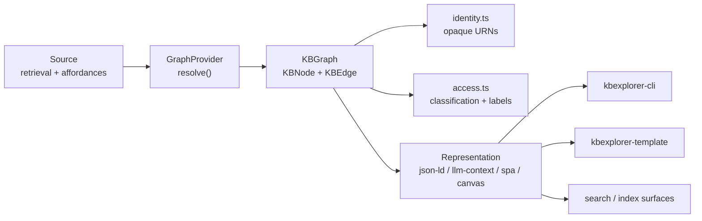

# KBX architecture

This package is the stable contracts layer of the `kbexplorer` stack. The canonical public surface is the barrel export in [`src/index.ts`](../src/index.ts), and it intentionally exposes only pure types, constants, and interface seams. Nothing in this repository performs I/O, rendering, or runtime orchestration; that logic belongs in the engine and downstream consumers.

## Repository boundary

The repo-level guidance in [`AGENTS.md`](../AGENTS.md) and the package README describe the same split:

- `kbexplorer-core` is the pure contract layer.
- `kbexplorer-engine` owns orchestration and provider execution.
- `kbexplorer-cli` and `kbexplorer-template` consume the contract and host the runtime experience.

This package does not try to be an engine or a renderer. It names the graph model, provider seams, source affordances, identity rules, access labels, and representation targets that the rest of the stack must agree on.

## Public entry points

The root entry point is the package barrel in [`src/index.ts`](../src/index.ts). It re-exports the canonical contract modules:

- [`src/graph.ts`](../src/graph.ts) — `KBNode`, `KBEdge`, `KBGraph`, `NodeSource`, `JsonLd`, `Connection`, `NodeLens`
- [`src/access.ts`](../src/access.ts) — `KBAccessLabel`, `AccessConfig`, default exclusion helpers
- [`src/jsonld.ts`](../src/jsonld.ts) — JSON-LD export helpers
- [`src/config.ts`](../src/config.ts) — `KBConfig`, identity and external-provider configuration
- [`src/identity.ts`](../src/identity.ts) — address construction and parsing (`buildAddress`, `parseAddress`, `buildId`, `buildEdgeId`)
- [`src/relations.ts`](../src/relations.ts) — canonical relation taxonomy and normalization
- [`src/source.ts`](../src/source.ts) — `Source`, `Resource`, `Affordance`, `STAGING_AREA_REL`
- [`src/provider.ts`](../src/provider.ts) — `GraphProvider`, `ProviderRegistry`, `ProviderModule`, compatibility checks
- [`src/graph-store.ts`](../src/graph-store.ts) — optional content-addressed cache contract
- [`src/representation.ts`](../src/representation.ts) — `Representation`, `RepresentationTarget`, `CANVAS_TARGET`
- [`src/presentation.ts`](../src/presentation.ts) — host-neutral presentation tokens

The package version exported by the library is `KBEXPLORER_CORE_VERSION` from [`src/index.ts`](../src/index.ts), which makes the public contract surface versionable without pulling in runtime implementation code.

## Core responsibilities

### 1. Stable graph semantics

The graph model in [`src/graph.ts`](../src/graph.ts) is the central contract. The primary durable structures are:

- `KBNode` — node identity, content, provenance, node source, access labels, derivation metadata, and optional `lenses` / `defaultLens` offer metadata.
- `KBEdge` — resolved directed relationship with `from`, `to`, `type`, `relation`, `weight`, and metadata such as `derivation`, `access`, and `relationRaw`.
- `KBGraph` — the aggregate graph object that carries nodes, edges, and cluster metadata.
- `NodeSource`, `NodeSourceFile`, `Connection`, `JsonLd`, `PageTheme` — the metadata model that a provider or engine can preserve without requiring a specific UI stack.

The comments in [`src/graph.ts`](../src/graph.ts) are unusually explicit: the package is data-only, and visual concerns such as styling, layout, and viewer selection live in the consumer rather than core.

### 2. Canonical identity and compatibility rules

Identity is defined in [`src/identity.ts`](../src/identity.ts). The key invariant is that the body of an address is opaque:

- `buildAddress()` creates `<scheme>://[<authority>/]<body>`
- `parseAddress()` splits the scheme and optional authority, but leaves the body opaque
- `buildId()` and `ID_RE` remain as legacy helpers only
- `buildEdgeId()` incorporates endpoints fully, so identities remain distinct across authorities and schemes

This is not a path-based identifier. The contract intentionally avoids encoding a node's type into the address body, so a resource can be retyped or rehomed without changing its identity. That invariant is part of the compatibility story for providers, search indexing, and downstream view layers.

### 3. Access policy as a label contract, not enforcement

The access boundary lives in [`src/access.ts`](../src/access.ts). `KBAccessLabel` is deliberately a label-only descriptor, not an authorization system:

- `classification` and `visibility` describe the resource
- `labels` allow host-defined policy tags
- `sourcePolicyRef` points to the governing policy definition
- the host enforces what those labels mean

The default-safe exclusion configuration (`DEFAULT_ACCESS_EXCLUSION`) says restricted or unknown classifications should be withheld by default. The purpose is to make the label portable while leaving authorization and redaction decisions to consumers and hosts. This is a critical boundary: Core describes policy intent, not principal evaluation.

### 4. Source and provider seams

The data-producing seam is `Source` in [`src/source.ts`](../src/source.ts), and the graph-producing seam is `GraphProvider` in [`src/provider.ts`](../src/provider.ts).

`Source` is retrieval-oriented:

- `retrieve(query)` returns `Resource[]`
- each `Resource` carries its own snapshot `affordances` and `links`
- `STAGING_AREA_REL` models a staging-area relationship explicitly
- the same `href` may yield different affordances on a later retrieval, so the seam is intentionally situational rather than permanent

`GraphProvider` is the graph transformation seam:

- a provider resolves graph fragments from one or more sources
- `requiredAffordances` guard a provider against unsupported retrieval capabilities
- `checkProviderCompatibility()` enforces semver + capability compatibility before a provider is instantiated
- `ProviderModule.apiVersion` and `capabilities` let the host detect incompatibility early and fail fast

This is the portion of the stack that hides the runtime implementation behind a pure contract, which makes third-party providers and source adapters possible without modifying the core package.

### 5. Representation as a downstream rendering seam

Core guarantees a pure graph, and then exposes a representation seam in [`src/representation.ts`](../src/representation.ts):

- `RepresentationTarget` is open-ended: `json-ld`, `llm-context`, `spa`, `canvas`, or custom targets
- `Representation.render(graph, options)` converts the same `KBGraph` into a target-specific output
- `RepresentationOptions` supports anchors, token budgets, and presentation tokens

This keeps the graph canonical while allowing different consumers to render the same data in different ways. The same graph can feed JSON-LD output, an LLM-context prompt, a SPA view, or a canvas-embedded surface.

## Type flow and consumer direction

The type flow is intentionally one-way:

- `Source` provides retrievable material.
- `GraphProvider` converts it into a pure graph.
- `KBGraph` carries identity, access, derivation, and provenance metadata.
- `Representation` turns that graph into target-specific output for CLI, template, or search/index consumers.

The core package is the contract boundary that makes those downstream layers interchangeable. It does not embed runtime logic and it does not know how the host renders or enforces access; it only defines the exact data and seam contracts.

## Invariants and compatibility expectations

The core contract is built around a few hard invariants that every consumer should preserve:

1. Identity addresses are opaque and source-agnostic. The body is not a path or a type encoding. See [`src/identity.ts`](../src/identity.ts).
2. Access labels are descriptive. They travel with the graph, but enforcement happens outside the package. See [`src/access.ts`](../src/access.ts).
3. Graph semantics are data-only. Styling, layout, and viewer resolution remain consumer concerns. See [`src/graph.ts`](../src/graph.ts) and [`src/presentation.ts`](../src/presentation.ts).
4. Provider compatibility is semver- and capability-guarded. Check `ProviderModule.apiVersion` and `checkProviderCompatibility()`. See [`src/provider.ts`](../src/provider.ts).
5. Open unions are deliberate. Many shapes (`DisplayMode`, `EdgeType`, `AccessClassification`, `RepresentationTarget`) keep well-known values while still allowing new consumer-defined values without breaking core.
6. The package remains dependency-free and side-effect-free. This is enforced by the package manifest and by the contract-only export structure in [`package.json`](../package.json) and [`src/index.ts`](../src/index.ts).

## Compatibility and extension guidance

### Additive changes only

The repository guidance in [`AGENTS.md`](../AGENTS.md) states that exported types and interfaces are part of the public contract surface and therefore should be treated as stable. This means:

- add fields and branches when they are additive
- avoid renaming exports without a coordinated downstream migration
- keep provider and source contracts compatible with existing host implementations

### Extend with open union members, not by changing the contract model

The core types are intentionally open-ended for extension. Examples include:

- `DisplayMode`, `EdgeType`, `ProviderCapability`, and `RepresentationTarget`
- `AccessClassification` and `AccessVisibility`
- `NodeSource` and `Structured` provider metadata

That lets a provider or a downstream host register a new graph relation, representation target, or access policy vocabulary without creating a breaking change in core.

### Keep the dependency direction pointed inward

The contract direction is intentionally inward to `core`:

- engine and providers depend on `core`
- consumers depend on engine and core
- core does not import rendering, browser logic, or runtime orchestration from any consumer or engine package

This keeps the shared trust surface in exactly one place and lets a change in provider or host behavior remain localized to the layer that actually owns it.

## Source references for the architecture

This document intentionally anchors to the real code that defines the package contract:

- [`src/index.ts`](../src/index.ts) — public barrel and version surface
- [`src/graph.ts`](../src/graph.ts) — graph data model and node/edge semantics
- [`src/source.ts`](../src/source.ts) — source and resource affordance contract
- [`src/provider.ts`](../src/provider.ts) — provider registry and compatibility contract
- [`src/access.ts`](../src/access.ts) — label-only access semantics and default safe exclusions
- [`src/identity.ts`](../src/identity.ts) — canonical address semantics and legacy compatibility helpers
- [`src/config.ts`](../src/config.ts) — the configuration contract that hosts and engines share
- [`src/representation.ts`](../src/representation.ts) — representation seam for different output targets
- [`src/graph-store.ts`](../src/graph-store.ts) — optional content-addressed store contract
- [`package.json`](../package.json) — package boundary and dependency-free contract definition

The implementation packages that consume these costs are outside this repository, but this package is the shared contract they all rely on.
